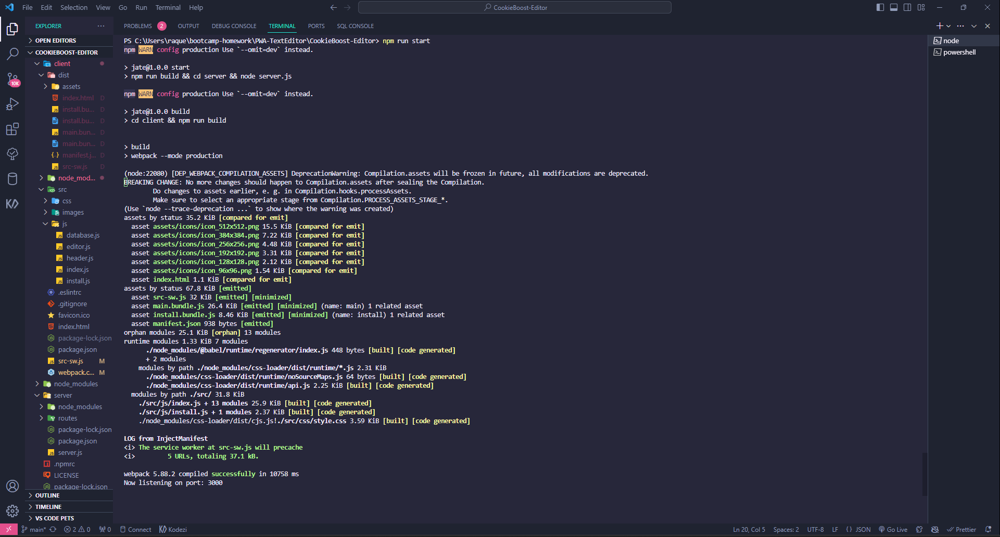

# CookieBoost-Editor


## Task
To build a text editor that runs in the browser. The app will be a single-page application that meets the PWA criteria. Additionally, it will feature a number of data persistence techniques that serve as redundancy in case one of the options is not supported by the browser. The application will also function offline.

## User Story
`````
AS A developer
I WANT to create notes or code snippets with or without an internet connection
SO THAT I can reliably retrieve them for later use

`````

## Acceptance Criteria

`````
GIVEN a text editor web application
WHEN I open my application in my editor
THEN I should see a client server folder structure
WHEN I run `npm run start` from the root directory
THEN I find that my application should start up the backend and serve the client
WHEN I run the text editor application from my terminal
THEN I find that my JavaScript files have been bundled using webpack
WHEN I run my webpack plugins
THEN I find that I have a generated HTML file, service worker, and a manifest file
WHEN I use next-gen JavaScript in my application
THEN I find that the text editor still functions in the browser without errors
WHEN I open the text editor
THEN I find that IndexedDB has immediately created a database storage
WHEN I enter content and subsequently click off of the DOM window
THEN I find that the content in the text editor has been saved with IndexedDB
WHEN I reopen the text editor after closing it
THEN I find that the content in the text editor has been retrieved from our IndexedDB
WHEN I click on the Install button
THEN I download my web application as an icon on my desktop
WHEN I load my web application
THEN I should have a registered service worker using workbox
WHEN I register a service worker
THEN I should have my static assets pre cached upon loading along with subsequent pages and static assets
WHEN I deploy to Heroku
THEN I should have proper build scripts for a webpack application

`````

## Table of Contents

* [Installation](#installation)
* [Usage](#usage)
* [Deployed-URL](#deployed-url)
* [Mock-Up](#mock-up)
* [Contributors](#contributors)
* [Questions](#questions)
* [Resources](#resources)

## Deployed-URL

https://cookieboost-editor-a0a32e7dc73d.herokuapp.com/ 

## Mock-Up

Demo:

The following image shows the npm run start on terminal:




The following image shows the application's manifest.json file:

The following image shows the application's registered service worker:

The following image shows the application's IndexedDB storage:

## Installation

The following necessary npm dependencies must be installed: 
* [Express](https://www.npmjs.com/package/express)
* [Babel](https://www.npmjs.com/package/Babel)
* [idb](https://www.npmjs.com/package/idb)
* [style-loader](https://www.npmjs.com/package/style-loader)
* [css-loader](https://www.npmjs.com/package/css-loader/v/6.4.0)
* [nodemon](https://www.npmjs.com/package/nodemon)
* [concurrently](https://www.npmjs.com/package/concurrently)
* [webpack](https://www.npmjs.com/package/webpack)

## Usage
Open terminal install npm packages and run npm run start from the root directory to start cd client && build for the webpack mode production. 

## Badges
* 
* 
* 
* 
* 
* 
* 
* 
* 


## Contributors

N/A

## Questions

For any questions, please contact me at the following links:
* **Creator** - 🎨 Raquel Tabarez
* [](mailto:raquelstabarez.07@gmail.com)
* [](https://github.com/Raquel-t)
* [](https://raquel-t.github.io/Professional-Portfolio-2nd-assignment/)

## Resources